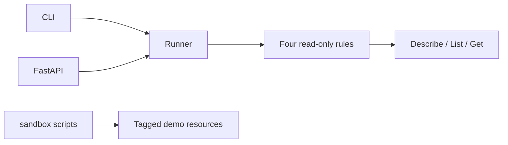

# CloudSweep

Python tool that scans **one AWS account and region** for wasted spend and risky firewall rules, then reports estimated monthly savings. It never modifies or deletes anything except the optional tagged sandbox.

It looks for:

1. Unattached EBS volumes
2. Idle Elastic IPs
3. Security groups open to the world on SSH, RDP, or all traffic
4. Missing `owner` / `env` tags on instances, volumes, and S3 buckets

## Two-minute quickstart

```bash
python -m venv .venv
.venv\Scripts\activate
pip install -r requirements-dev.txt
pytest
```

Against a real account (after the IAM setup in `docs/runbook.md`):

```bash
python -m sandbox.create_waste --profile cloudsweep-sandbox --yes
python -m scanner.cli --profile cloudsweep-scanner
uvicorn api.main:app --port 8000
python -m sandbox.destroy_waste --profile cloudsweep-sandbox --yes
```

API: http://127.0.0.1:8000 — OpenAPI at `/docs`.

```bash
docker build -t cloudsweep .
docker run --rm -p 8000:8000 -e AWS_ACCESS_KEY_ID -e AWS_SECRET_ACCESS_KEY -e AWS_REGION=ap-south-1 cloudsweep
```

## Architecture



## Docs

- [Project spec](docs/PROJECT_SPEC.md)
- [Requirements](docs/requirements.md)
- [Design](docs/design.md)
- [Test plan](docs/test_plan.md)
- [Runbook](docs/runbook.md)

## Safety

- Scanner identity: read-only.
- Sandbox identity: separate, and it will not run unless `CLOUDSWEEP_ALLOWED_ACCOUNT_ID` matches the caller.
- Destroy only deletes resources tagged `sandbox=cloudsweep`.

Dashboard screenshot: run the API locally and use **Run scan** after `create_waste`; you should see five findings and a non-zero estimated monthly savings figure.
