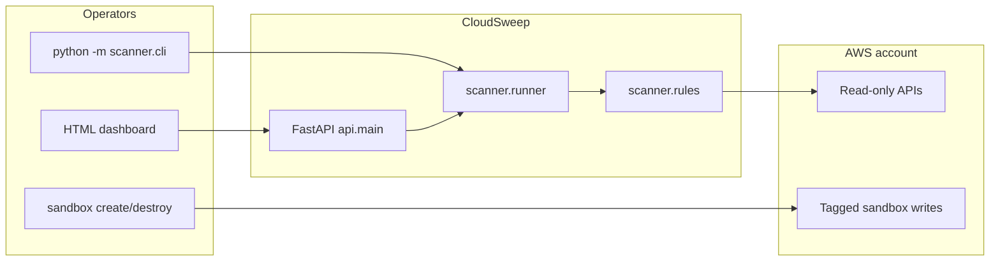

# CloudSweep design

## Architecture

## Components

- **`scanner/`** — models, env config, pricing constants, four rules, runner, CLI.
- **`api/`** — thin FastAPI wrapper; latest result in memory behind a lock; Jinja2 dashboard.
- **`sandbox/`** — create/destroy demo resources tagged `sandbox=cloudsweep` only after `assert_safe_account()`.
- **Tests** — moto `mock_aws` so CI never needs a real account.
- **Docker** — serves the API as a non-root user; credentials passed at runtime.

## Data flow

1. CLI or `POST /scan` builds a boto3 session (profile or env credentials).
2. `run_scan` reads the account ID from STS, runs each rule, logs rule failures without aborting the whole scan, sorts findings (high → low, then cost descending), and builds a summary.
3. CLI writes `report.json`. The API also stores the latest result in memory and on disk (`REPORT_PATH`).
4. Sandbox create plants four resources (five expected findings). Destroy discovers by tag and deletes SG → EIP → volume → bucket.

## Data model

See `scanner/models.py`: `Finding`, `ScanSummary`, `ScanResult`. Optional `errors` captures per-rule exceptions.

## IAM design

Two identities (policies in `docs/PROJECT_SPEC.md` Appendix B):

- **cloudsweep-scanner** — describe/list/get only.
- **cloudsweep-sandbox** — create/delete the demo resources.

`sts:GetCallerIdentity` is allowed by default.

## Security decisions

- Scanner never calls mutating APIs.
- Sandbox refuses to run if `CLOUDSWEEP_ALLOWED_ACCOUNT_ID` is missing or mismatched.
- Destroy never deletes untagged resources.
- `--yes` and `--dry-run` prevent accidental writes.
- Docker image contains no keys.

## Limitations

Single region per run, approximate pricing, no idle-instance CPU checks, no remediation, results are not stored in a database.

## Future work

Organizations + cross-account roles, OIDC for GitHub Actions, Slack alerts, CloudWatch-based idle EC2, approval-based cleanup.
